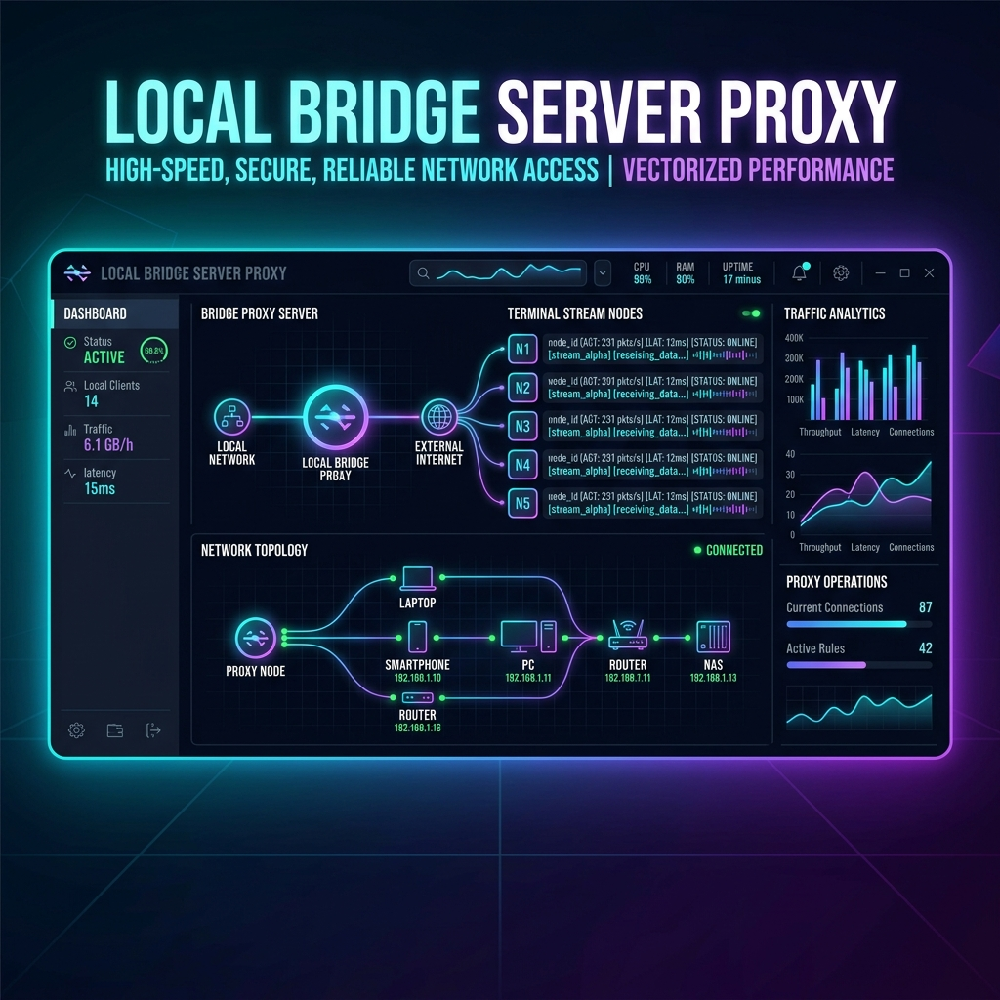
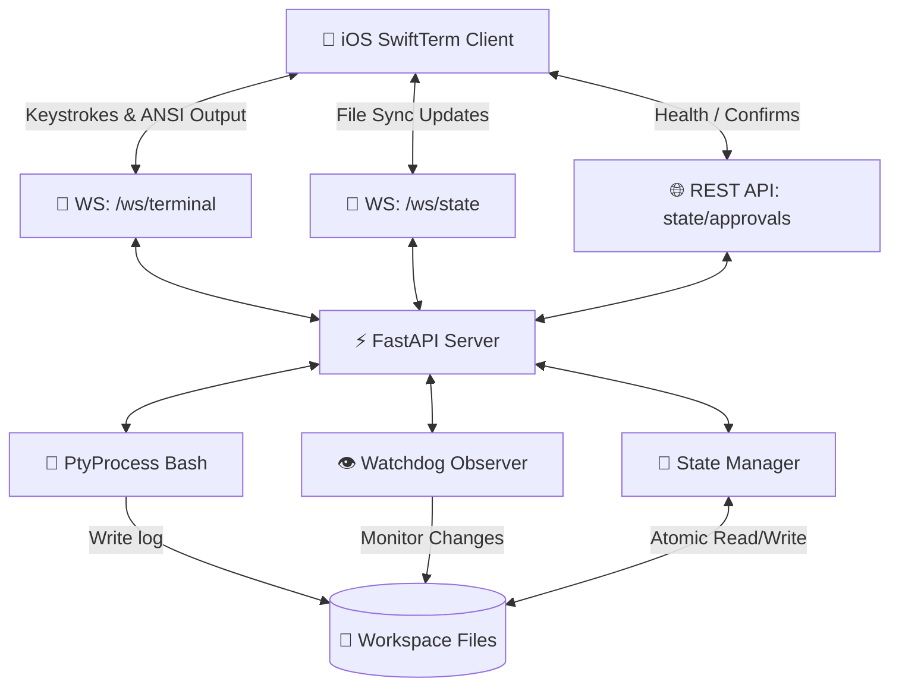

# 🎛️ Gravity Link - Local Bridge Server Proxy

🚀 **A High-Performance Middleware Proxy facilitating Bi-Directional Terminal Streaming (PTY), File System Syncing, and Human-in-the-Loop (HITL) Approvals for local iOS development.**



---

## 🌟 Overview

**Gravity Link** acts as the local network middleware layer between your development workstation and external iOS clients (such as SwiftTerm terminals). It ensures lightning-fast terminal streaming, atomic state-file synchronization, and structured approval gates for automated agents.

### 🛠️ Core Capabilities
* **🔌 Bi-Directional PTY Proxy:** Spawns interactive processes (e.g. `/bin/bash`) and streams raw ANSI output while accepting keystrokes via low-latency WebSockets.
* **📂 Real-time Filesystem Syncer:** Observes local changes inside the `workspace/` folder using `watchdog` with high-performance, async-native debouncing.
* **🛡️ HITL Gatekeeper:** Implements approval mechanics (`pending_approval.json`) for agent task confirmations.
* **⚡ Highly Concurrency-Safe:** Uses filesystem locks, temporary files, and atomic replacements to guarantee zero JSON read/write corruption.

---

## 📐 Architecture



---

## 🚀 Quick Start Guide

### 📋 Prerequisites
Ensure you have [uv](https://github.com/astral-sh/uv) installed (the ultra-fast Python package installer & resolver).

### 1️⃣ Installation & Environment Initialization
Clone the repository and initialize the project:
```bash
# Verify environment dependencies are resolved automatically by uv
uv sync
```

### 2️⃣ Run the Bridge Server
Fire up the local server:
```bash
uv run python src/main.py
```
*The server will bind to `0.0.0.0:8000` to be discoverable over your local WLAN.*

### 3️⃣ Execute Tests
Verify all system components:
```bash
uv run python -m pytest
```

---

## 🔌 API & WebSocket Documentation

### 🔍 Health Check
* **Endpoint:** `GET /health`
* **Response:**
  ```json
  {"status": "online", "version": "1.0.0"}
  ```

### 📂 State APIs
* **Endpoint:** `GET /state`
  * Returns current state representation from `workspace_state.json`.
* **Endpoint:** `GET /approval/pending`
  * Returns contents of `pending_approval.json`.
* **Endpoint:** `POST /approval/confirm`
  * Confirms pending approval by updating status to `"approved"`.

### ⚡ WebSocket Streaming
* **Terminal Channel:** `ws://<host>:8000/ws/terminal`
  * Receives raw ANSI streams from the workstation terminal.
  * Accepts raw keystroke input to feed to the terminal subprocess.
* **State Sync Channel:** `ws://<host>:8000/ws/state`
  * Pushes immediate, debounced (0.5s) notifications of file updates to `workspace_state.json` and `pending_approval.json`.

---

## 🤖 Agent Rules (Human-in-the-Loop Protocols)

For agents operating inside this workspace environment:
1. **State-First Update:** Always write current context status to `workspace/workspace_state.json` before executing commands.
2. **Explicit Authorization:** Write proposed operations/dependencies to `workspace/pending_approval.json` and wait until the status changes to `approved` before proceeding.
3. **No GUI Context:** Always run commands headlessly.
